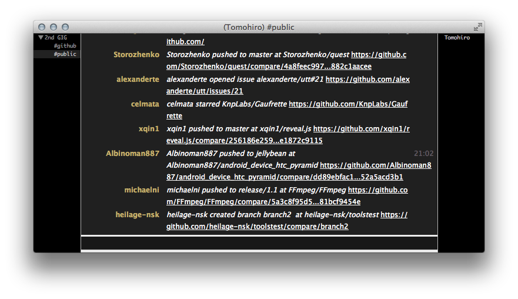

2nd GIG
================================================================================

Alternative GitHub IRC Gateway

[](http://stillmaintained.com/Tomohiro/2nd_gig)
[](https://gemnasium.com/Tomohiro/2nd_gig)
[](https://gemnasium.com/Tomohiro/2nd_gig)
[](https://codeclimate.com/github/Tomohiro/2nd_gig)
[](LICENSE)




Requirements
-------------------------------------------------------------------------------

- Ruby 1.9.3 or later


Installation
--------------------------------------------------------------------------------

### Bundler

```sh
$ git clone git://github.com/Tomohiro/2nd_gig.git
$ cd 2nd_gig
$ bundle install --path vendor/bundle
```


Usage
--------------------------------------------------------------------------------

### Start service

```sh
$ bundle exec 2nd_gig
```

Example: Change listen IP address, port.

```sh
$ bundle exec 2nd_gig --server 192.168.10.1 --port 16667
```


### Connect the 2nd GIG

1. Launch a IRC client.(Limechat, irssi, weechat...)
2. Connect the server(option is below)
3. Join optional channel if you wanted.

#### Options

Setting server properties.

option    | value
--------- | -----
Real name | GitHub username
Password  | GitHub news feed token


### Channels

Channel    | Description                    | Auto join
---------- | ------------------------------ | ---------
`#github`  | News feed timeline             | yes
`#public`  | Public timeline                | no
`#private` | Private activity feed timeline | no


LICENSE
--------------------------------------------------------------------------------

&copy; 2012 - 2015 Tomohiro TAIRA.
See LICENSE for details.
